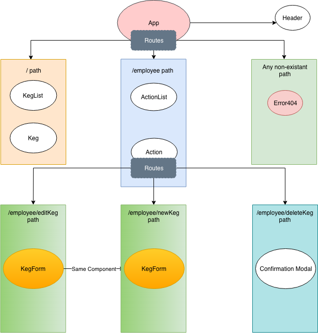

# React Tap Room

## Epicodus Independent Project Week 1 - React - November 16th, 2018

### By **Skye Nguyen**

## Description

Recreating an application for employees at a local Tap Room to manage the inventory and for the customers to explore the available menu options.

Differences in development process in Angular and React:

* React components are based on the UI of the application while those in Angular are based on functionality.
* Developing in Angular seems to take more time due to the amount of syntax required for a simple task.

## Specifications

* Patrons should be able to access the bar's menu.
* Employees should be able to add/edit/delete kegs.

## Development Notes & Issues

* Had issue with routing the keg new/edit form (Solved).
* Had issue with overall page styling (body margin specifically) (Solved).

## Known bugs

None

## Contact & Support

Skye Nguyen - @sn31 - skye@dames.es

## Technologies used

* JavaScript
* React
* Firebase
